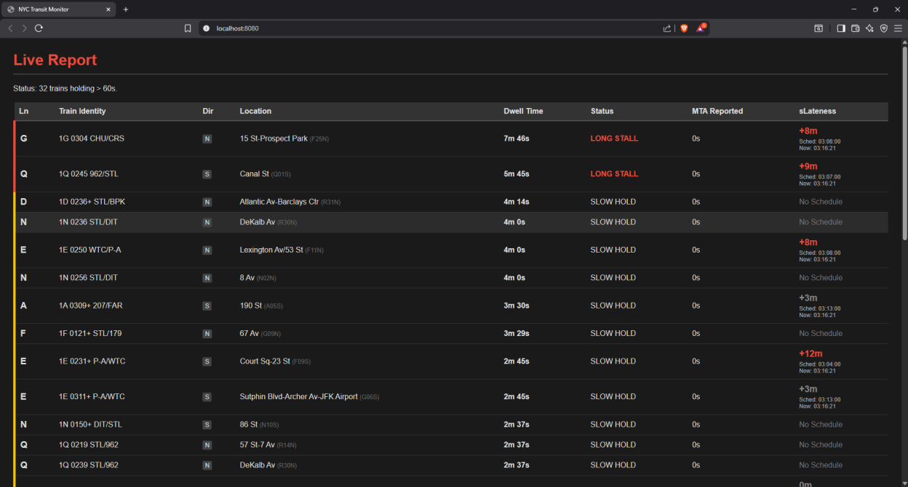
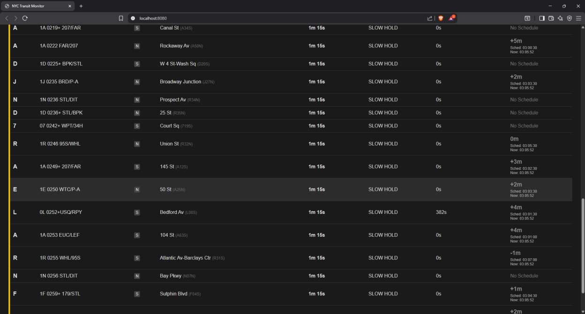

# Transit Performance Analytics (TPA) – NYC Subway

**A tool for analyzing actual train movement in the NYC subway using raw GTFS-Realtime data.**  
TPA shows *true* dwell time and lateness, ignoring official MTA delay claims and reconstructing real train performance independently.

---
Below is a live TPA dashboard showing real-time train holds, dwell times, true lateness, and official MTA “reported delay” fields.*


---

## Table of Contents

- [Quick Start](#quick-start)
- [Features](#features)
- [Installation & Build Instructions](#installation--build-instructions)
  - [Linux Debian/Ubuntu](#linux-debianubuntu)
  - [Windows (MSVC Build Tools + vcpkg)](#windows-msvc-build-tools--vcpkg)
- [How TPA Works](#how-tpa-works)
  - [How TPA Treats the MTA Feed](#how-tpa-treats-the-mta-feed)
  - [Core Metrics](#core-metrics)
  - [Offline Replay (No API Key Required)](#offline-replay-no-api-key-required)
- [Directory Layout](#directory-layout)
- [The Problem With Official Delay Reporting](#the-problem-with-official-delay-reporting)
- [Credits & License](#credits--license)

---

## Quick Start

1. **Clone the repository:**
    ```bash
    git clone --recurse-submodules https://github.com/LawlietDN/TPA.git
    cd TPA
    ```
2. **Run a pre-recorded session (offline replay):**
    ```bash
    path/transitAnalyzer --replay recordings/session.rec
    ```
3. For live data see [Installation & Build Instructions](#installation--build-instructions) below.

---

## Features

- Analyzes *actual* subway motion from MTA’s GTFS-Realtime feed, makes no assumptions about official “delay” reporting
- Computes **physical dwell time** (actual time a train spends at a station) and **true lateness** (difference between observed and scheduled arrivals)
- Deterministic, replayable sessions (no API key needed for demo)
- Fully local; uses SQLite to maintain a rolling history for 7 days

---

## Installation & Build Instructions

### Linux Debian/Ubuntu

```bash
sudo apt-get install build-essential cmake g++ libssl-dev libprotobuf-dev protobuf-compiler libboost-all-dev libsqlite3-dev libcurl4-openssl-dev git
git clone --recurse-submodules https://github.com/LawlietDN/TPA.git
cd TPA
cmake --preset linux
cmake --build --preset linux
export MTA_API_KEY=your_key_here
./build/linux/transitAnalyzer
```

### Windows (MSVC Build Tools + vcpkg)
```powershell
vcpkg install boost-system boost-headers openssl protobuf sqlite3 curl
vcpkg integrate install
git clone --recurse-submodules https://github.com/LawlietDN/TPA.git
cd TPA
cmake --preset windows-vcpkg
cmake --build --preset windows-vcpkg
$env:MTA_API_KEY="your_key_here"
.\build\windows\Release\transitAnalyzer.exe
```


## How TPA Works

### What TPA Is

This is **TPA**, a tool for analyzing **actual subway movement in New York City**. Unlike typical transit apps that simply display scheduled arrivals and delays reported by the MTA, this system makes **no assumptions** about the accuracy or honesty of those figures. It works by **analyzing the raw telemetry** and inferring actual train movement.

The project is written in **C++20** and structured as a **multi-threaded daemon**. It fetches raw binary protobufs from the MTA’s **GTFS-Realtime** endpoints over HTTPS. Every 30 seconds, it concurrently hits eight different endpoints (such as **A/C/E**, **1/2/3**, **N/Q/R**, etc.).

---

### How TPA Treats the MTA Feed

The MTA’s real-time feed is **stateless**. Each snapshot is a moment in time, with no awareness of what came before. TPA imposes structure onto that by **keeping a running history**. It merges `VehiclePosition` and `TripUpdate` messages into unified train snapshots and stores these in a **SQLite database**, in-memory but backed on disk. Every hour, a cleanup job trims old data beyond a **seven-day window**.

---

### Core Metrics

#### Physical Dwell Time

**Physical Dwell Time** is the **actual time a train spends at a specific station**, determined by examining timestamps for a given train ID at a given stop ID. If a train appears to be sitting at Utica Avenue from T=0 to T=600, TPA takes that at face value: it has been stuck there for ten minutes.

This does **not** rely on the MTA’s `status` field or any declared delays; it just looks at **where trains are and how long they stay there**. Known yard and terminal stations are filtered out deliberately to avoid misinterpretation and to keep the focus on real passenger-impacting holds.

#### Lateness

**Lateness** is derived by **comparing the current timestamp to the scheduled arrival time** from the static GTFS schedule. That schedule is stored locally in a large dataset parsed from `stop_times.txt`. It matches realtime trip IDs to static trip IDs, exposing mismatches between the MTA’s reported delay (often zero) and the **actual deviation from the schedule**.

For example, the MTA may claim a train is “on time,” while TPA shows that, relative to the schedule, it is actually **14 minutes late**. TPA always trusts the observed motion and the schedule, not the advertised delay.

---

### Offline Replay (No API Key Required)

TPA supports deterministic recording and replaying of data streams. This allows for offline debugging and analysis of specific incidents.

You **do not need an MTA API key** to see the system in action. If you just want to try it without configuring anything, a **pre-recorded session** has been provided. You can replay this data using the `--replay` command:

```bash
--replay recordings/session.rec
``` 
This runs the full pipeline, parsing GTFS-Realtime data, populating the database, and serving the dashboard exactly as if it were processing live data from the MTA.

If you do have an API key and want to gather your own data, you can also record a session:
```bash
--record recordings/my_session.rec
```
Later, you can replay that same recording offline using the same --replay option and inspect that period in as much detail as you want.

## Data and Directory Layout

The data/ directory contains static GTFS files. TPA needs stops.txt and stop_times.txt from the MTA’s subway static feed. These are used to resolve station names and compute lateness. Updated feeds can be downloaded from https://www.mta.info/developers
. Replace the existing files if they are outdated.

The proto/ directory holds gtfs-realtime.proto and nyct-subway.proto, used during build time. No changes are needed unless the schema changes upstream.

## The Problem With Official Delay Reporting

During development and real-world testing of TPA, a **consistent discrepancy** was observed in the `delay` field reported across subway lines:

- **L and 7 lines:**  
  The delay field is usually populated with real, non-zero values (like `382`, `-135`, etc.).
- **Other lines (A/C/E, 1/2/3, N/Q/R, etc.):**  
  Almost always report a delay of exactly `0`, even when trains are clearly behind schedule.  
  TPA often shows a train **15 minutes late** while the feed claims “on time.”
  
Below, you can see an example from the TPA dashboard:  
**Only the L line shows nonzero delay, while all other lines report 0, even when behind schedule.**

Notice the L line (row with "L" at left) shows a nonzero delay, but other lines like A, D, N, etc., all show `0` delay, even when late.*


This is due to how the MTA provides and structures its GTFS-Realtime data. According to MTA developer support and official guidance:

> “NYCT's GTFS-RT feed operates slightly differently than the spec. The trips specified in the feed are intended to replace the base schedule for the duration specified in tripReplacementPeriod. The trips are not to be matched by consumers against the static GTFS. This is due to the complexity and number of internal schedule revisions that are implemented every day.
>
> The time fields in the feed represent the expected arrival time of that trip at that station, taking into account its last reported position and any schedule deviation.”
>
>  MTA Developer Resources ([source](https://groups.google.com/g/mtadeveloperresources/c/qxQq5LhzYwE/m/Ix2DEKTQAgAJ))


- The **L and 7 lines** use **CBTC (Communications-Based Train Control)**, which allows for precise delay calculation.
- Other lines use **fixed-block signaling**, so their feeds lack accurate real-time delay information and default to `0`.

Since the official MTA delay numbers are often absent or unreliable for most lines. **TPA computes its own “lateness” by comparing observed train movement to the static schedule.

## Credits & License

This project uses GTFS static and real-time data made publicly available by the Metropolitan Transportation Authority (MTA):
https://new.mta.info/developers

TPA is not affiliated with or endorsed by the MTA.
